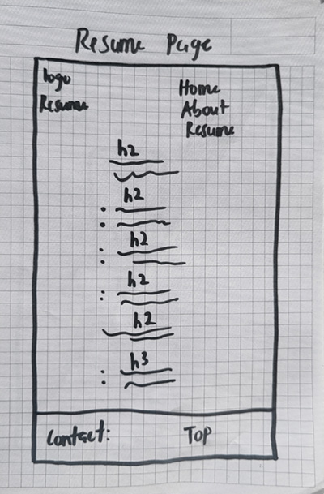

# Project 1: Design Journey

## Personal Site (Milestone 1)

### Website Topic (Milestone 1)
> Briefly explain what your website will be about. Share your vision of your personal website.
My website will be about myself, featuring areas like my bio, likes and dislikes and my goals in life.
New_plan_below.

My website is intended to meet the goals of future employers. my skills, education and career path will be key content in my website.

## Personal Website Design Exploration (Milestone 1)

Identify three personal websites (preferably static websites) that exist today on the web. You will be drawing inspiration from these sites for your own site; please select websites that are similar to the website you wish to create.

Include a screenshot of the home page for each site. If you're planning a mobile website, your screenshots should be from a mobile website. If you're planning a desktop website, your screenshots should be from a desktop website.

**We'll refer to these are your "example websites."**
 <https://taylorvowell.com/#tab-0>
 

 <https://www.byronmcnally.co.uk/>>
    

 <https://www.cs.cornell.edu/~bindel>
    

### Personal Website 1 Review (Milestone 1)
> Review the personal website you identified above. (1-2 paragraphs)
>
> - Who do you think this site is designed for? Who is its intended audience?
> - What **goals** do you think the audience likely has when visiting this site.
> - What **content** is included?
> - Do you believe the content likely **addresses** the goals of the site's audience?
> - What do you like about the design?
> - Is the site designed for desktop, mobile, or desktop and mobile devices? Desktop
  1.The site was designed for people interested in his Prefession and wolud like to work with him.
  2.His Audience expert to know about his skills, potientials, sucess stories and the vision that drive his work.
  3.Home, About, Experience and Contact.
  4.I think the content addresses the needs of the audience.
  5.I like the Colour scheme and the animation.
  6.The site was designed for Desktop.

### Personal Website 2 Review (Milestone 1)
> Review the personal website you identified above. (1-2 paragraphs)
>
> - Who do you think this site is designed for? Who is its intended audience?
> - What **goals** do you think the audience likely has when visiting this site.
> - What **content** is included?
> - Do you believe the content likely **addresses** the goals of the site's audience?
> - What do you like about the design?
> - Is the site designed for desktop, mobile, or desktop and mobile devices? phones and Desktop
  The website was designed for his followers,people interested in his Brand and for people who would like to do business with him
 The audience would love to know about about his works,and Achievement, including his awards and nomination.
  Home, about, Awards,Contact, Slate, Film, Commercial, and Music.
  The Content addresses the goals of the audience.
  I like it's simplicity.
  The site is designed for both desktop and phones.

### Personal Website 3 Review (Milestone 1)
> Review the personal website you identified above. (1-2 paragraphs)
>
> - Who do you think this site is designed for? Who is its intended audience?
> - What **goals** do you think the audience likely has when visiting this site.
> - What **content** is included?
> - Do you believe the content likely **addresses** the goals of the site's audience?
> - What do you like about the design?
> - Is the site designed for desktop, mobile, or desktop and mobile devices? Desktop
  The website was designed mainly for student and other faculty members.
  To know the classes he teaches, research fileds and his specializations.
  Home, CV, Research, Teachings, Publications,Talks, Software, Student, Sermom, Links.
  The content addresses the goals of the audience.
  I like the whitespaces in the website, It has made the content clear and visible.
  The site was designed for both desktop and mobile devices.

## Audience & Goals (Milestone 1)

Using what you learned from studying the example websites, identify your website's audience and their goals.

### Audience (Milestone 1)
> Briefly explain who the intended audience is for your website. Be specific and justify why this audience is appropriate for your site's topic
My intended audience is future employer, friends and family. My freiends and family ahve similar goals, they would like to know my hobbies, likes and dislike, and my goals in life. Future employers would also want to know more about my educational history, my program of study and my skills.

New_plan_below

My audience are future employers.
I changed my audience to just Future employers because I can't satisfy the needs of my friends and family together with my audience on one website.

### Audience Goals (Milestone 1)
> Why would your audience visit your site?
> Identify at least 3 goals that your users have for visiting your website.
 To know my potentials and capabilities.

 To know more about my chosen career path.

 My contact details.

## Content Planning (Milestone 1)

Plan your site's content.

### Your Site's Planned Content (Milestone 1)
> List **all** the content you plan to include your personal website.
> You should list all types of content you planned to include (i.e. text, photos, images, etc.)
  Home
  About
  Resume
  contact

### Content Justification (Milestone 1)
> Explain (about a paragraph) why this content is the right content for your site's audience and how the content addresses their goals.
My content is right because they will satisfy the needs of
 my audience. A future employer will visit my site and they know my educational background, my skills and experience and also my career plan in order to help them makes a decision about my employment status.

### Home Page Content (Milestone 1)
> What is the content that your users would expect when visiting your site for the first time.
>
> Briefly identify what content you will include on the homepage and why this content should be the first thing your target audience sees when they visit your site.
My home page will include a the interesting part of my resume, my vision statement, and my contact details.

## Information Architecture (Milestone 2)

For milestone 2, you will design the information architecture for all the pages your website.

You may change your homepage content based on your card sorting. If you do change the homepage content, don't update it above, just include the new plan in the section below (Content Organization).

### Content Organization (Milestone 2)
> Document your **iterations** of card sorting here. You must have at least 2 iterations of card sorting.
> Include photographic evidence of each iteration of card sorting **and** description of your thought process for each iteration.
> Please physically sort cards; please don't try and do this digitally.

This was my first card sorting, I will use the home page as a welcome page, making your home page friendly will make it a welcoming environment for my audience. I will have four webages.

This is my final card sorting. I will make the home home page comprehensive with the information i think will be relevant to my audience, this is to make sure that i satisfy the goals of my audience. the other two pages resume and about will have information that I think may be optional to my audience.

### Final Content Organization (Milestone 2)
> Which iteration of card sorting will you use for your website?
The final card sorting.
> Explain how the final organization of content is appropriate for your site's audiences.
I choose the final card sorting because my audience are mostly busy and will not have all the time to explore all the webpages before getting the relevant information they need. hence, presenting the most relevant information on the home page will be a good idea to meet their goals. If you

### Navigation (Milestone 2)
> Please list the pages you will include in your website's navigation.
  Home
  About
  Resume

Why I Changed the Webpages to 3.
In the first milestone, I had 4 webpages but I decided to make it 3 because I think I don't really need a webpage for contacts for my audience. with my area of mastery on my homepage, future employers can know my worth and connect with me faster, they are mostly busy so I think this will save them some time

> Explain why the names of these pages make sense for your site's audience.
The names are clear and informative, it will direct my audience to the webpages they wish to explore easily.
I think the name of website should not confuse your audeience but rather direct them to navigate through the site efficiently.

## Visual Themes (Milestone 3)

**Make the case for your decisions using concepts from class, as well as other design principles, theories, examples, and cases from outside of class.**

Remember to focus on the things we can't see just by looking at the site: changes, alternatives considered, processes, and justifications.

Each section is probably around 1 reasonably sized paragraph (2-4 sentences).

### Theme Ideas (Milestone 3)
> Discuss several (more than two) ideas about styling your site's theme. Explain why the theme ideas are appropriate for your target audiences.
I want my website to be formal website because the fits my intended audience.

1.The background color will be black and the text will be white for visibility. The border around the images will be a square to communicate the feeling of genunity. I will use normal font types and bold font accordingly. I will center my logo on top of the webpages.

2.The background colour will be white and the text color will beblack and orange, I prefer these two colours because they will make the content visible. I will  left align my the elements on the pages.

3 I will use gray as my background colour, I will center all the element on the pages with the exception of of my logo, h1 elements and the navigation bar. I will add a welcome image to my home page.

### Final Theme (Milestone 3)
> Which theme did you select as your final theme? Why?
I chose the last theme for my website because, I think gray is more appropriate, black is too dim and white may end up hurting the eye when the user view the page for a long period of time. I decided to use contrasting colours to make the site more readable and my user will be drawn into the content immediately they visit my website.I added a welcome image wto make the site welcoming to my audience.

### Theme Rationale (Milestone 3)
> Discuss your final theme design: how do they fit your overall design goals and audiences?
My overall goal was to keep my website formal because of my targeted audience. My final design theme will fit the overall goals and the goals for my audience because I used the appropraite color for the background to make the content readable.
> Emotion is a big part of design. What emotions were you thinking about or trying to convey in your designs?
I was thinking about implementing an emotion of serious and authenticity on my website. I want my audience to feel that I am a serious person who will be dedicated and committed to the job when they work with me.I added a welcome image to the homepage because I want to communicate a feeling that I am welcoming and a friendly person.

## Composition (Final Submission)

### Home Page Composition (Final Submission)
> Include at least two sketches of possible composition ideas for the home page.
> Provide an explanation for each sketch explaining the idea.
> Show your design process.
> **Use the example websites above as inspiration for your site's design.**

I decided to left align the logo and the navigation bar,
center the heading and left align the all other elements on the webpage.

I decided to left align the logo and the header, right align the navigation
bar with the rest of the content center align. I also decided to include a
footer with a link taht will send the users to the top of the page so they that, they can quikly access the navigation bar when they finifh viewing the content on a page and they want to move to the next page.

I decided to left align the logo, right-align the navigation bar and center
the heading in between the two.The image will be left aligned with
the rest of the content centered.

### Final Site Design (Final Submission)
> Include a sketch of the final composition for each page in your site.
> Provide an explanation below each sketch.

I decided choose this design out of the other desighns because i think this design alihns with the goals of my audience.

The final design for my about page has the same layout as the home page, the navigation bar
is left align, the logo and the page header are right align. I have a
picture of myself centered, the rest of the content is also centered.

The final design for my about page has the same layout as the home page, the navigation bar
is left align, the logo and the page header are right aligned. he rest of the content is also centered.

### Static Website Design Check (Final Submission)
> We're building a static website without interactivity.
> **No part of your website may dynamically change.**
> Examples of dynamic behavior are dropdown menus, hamburger menus, popups, modals/lightboxes, image carousels, etc.
>dfd
> Audit your design and check that you aren't relying on any dynamic features.
As a beginner designing static website will help me grasp the fundamentals of building a website,
also it may be difficult for me to create a dynamic website as a beginner.
I will be able to build on what what i learnt for designning a static website
to simply design a dynamic website afterwards.

## Rationale (Final Submission)

**This rationale should be polished writing:** one you might submit as a report to a client or boss to help explain the project and convince them you did a good job. You'll be surprised how much writing and communicating you need to do about projects and choices on internships and jobs; practice that here.
It should be a comprehensive, complete story of the project. You might find that each section runs a few paragraphs (1-2). Sketches can often help tell the story of your design. Screenshots are also useful for describing issues discovered during the design process and how you addressed them.

**All images must be visible in "Markdown: Open Preview" for credit!**

Your rationale should be a polished version of the earlier explanations.

### Audience (Final Submission)
> A complete and polished description of the intended audience(s) for your website.
My intended audience are future employers, which may include employers
from diverse industries, human resource and hiring managers, decision makers
and recuiters. These people are potential future employers. These people are mostly busy and don't waste time on things that are irrelevant to them. They want things to be concise and prfessional as possible.

### Design Goals (Final Submission)
> An explanation of the design goals for that audience, based on your earlier rationales.
These audience want thing clear and organised, a comprehensive showcase of your skills and experience. They would your  like to know a little bit abut who you are, that is your personality, this can also help them decide if you are a good fit for the job. They wolud also like to know your contact details.

### Content Organization & Navigation (Final Submission)
> An explanation of how the final content organization and navigation met your goals and why it's appropriate for your audience.
Throughout the design, process I focused on making the key content readily available to my audience.
I met the goals of my Audience by providing the right content oon all pages, I also took into consideraion their busy nature and tried to summerize the key content on the home page so that if they are very busy they can access the key content they need right on the homepage and they can explore further if they have enough time.

### Visual Design (Final Submission)
> An explanation of how the final design met your goals and why it's appropriate for your audience.
The final design met my goals because I was able to meet the goals of my Audience with is key in designing a usable website.
My website is appropriate for my audience becaused I addressed their need and they get all the relevant information they need about me to help them to make a decision about me.

### Self-Reflection (Final Submission)
> Take some time here to reflect on how much you've learned since you started this class. It's often easy to ignore our own progress. Take a moment and think about your accomplishments in this class. Hopefully you'll recognize that you've accomplished a lot and that you should be very proud of those accomplishments!
Before Taking this Class, I knew a bit of HTML but Actually this class has helped
me refine what i already knew, now I use the best practices when coding websites,
I have graps a fundamentals of creating a usable website, that is thinking like the
user when planning the website in order to meets the expectations of you users.
## Grading (Final Submission)

### Grading: Open the Design Journey in Markdown: Open Preview (Final Submission)
> Preview your design journey in VS Code. Please verify that this document is easy to read/grade.
>
> - Remove all _TODOs_
> - All images must be visible.
> - All images must be oriented the correct way.
> - There should be a blank line between the question prompt and your answer.
>
> Is your design journey easy to read?
My design journey is easy to read and ready to grade.

### Collaborators
> List any persons you collaborated with on this project.
I did the work alone with the help of TA's.

### Resources
> Please cite any external resources you used in the creation of your project.

The Mozilla Documentation
Google.com
